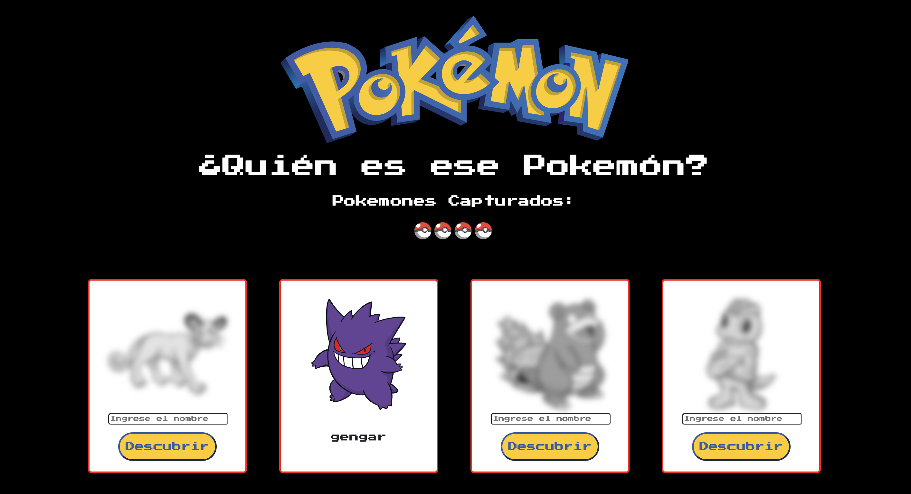

# Prueba - Desarrollo de interfaces interactivas con vue.

Este proyecto es una aplicación de Vue.js que permite a los usuarios adivinar los nombres de diferentes Pokemon. Utiliza la API para obtener datos sobre varios Pokemon y muestra tarjetas coloreadas de estos en una cuadrícula.

### Estructura del proyecto:   
* App.vue: Componente principal de la aplicación.  
* PokeCard.vue: Componente hijo utilizado para mostrar cada tarjeta de Pokémon.

### Funcionalidades:  
* Mostrar una lista de Pokémon obtenidos aleatoriamente de la API de Pokémon.  
* Permitir a los usuarios adivinar el nombre de cada Pokémon.  
* Marcar un Pokémon como adivinado correctamente si el usuario ingresa el nombre correcto.  
* Contar y mostrar el número total de Pokémon adivinados correctamente.  
